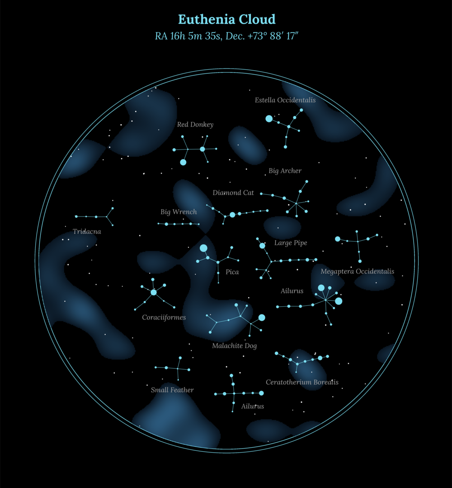
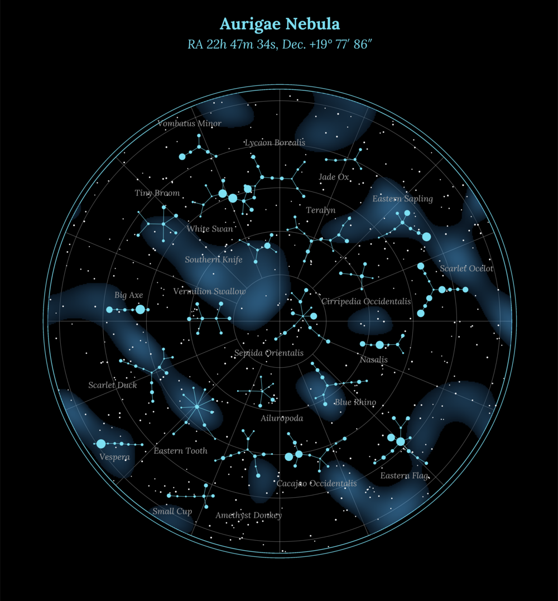
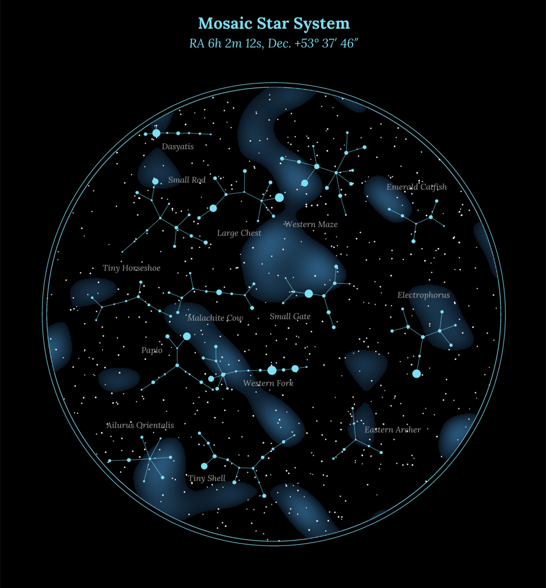
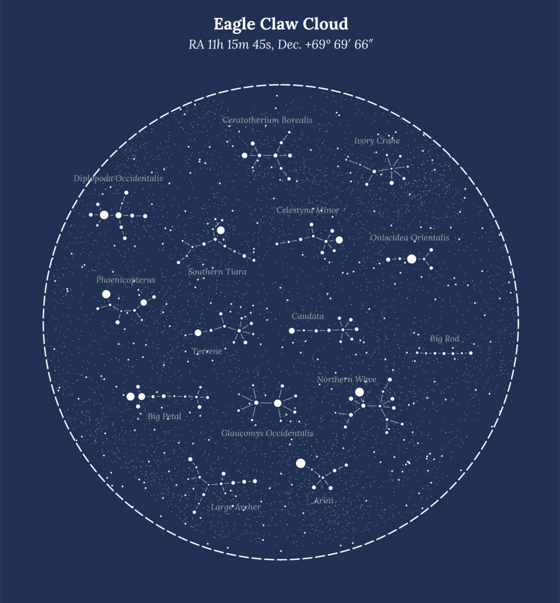
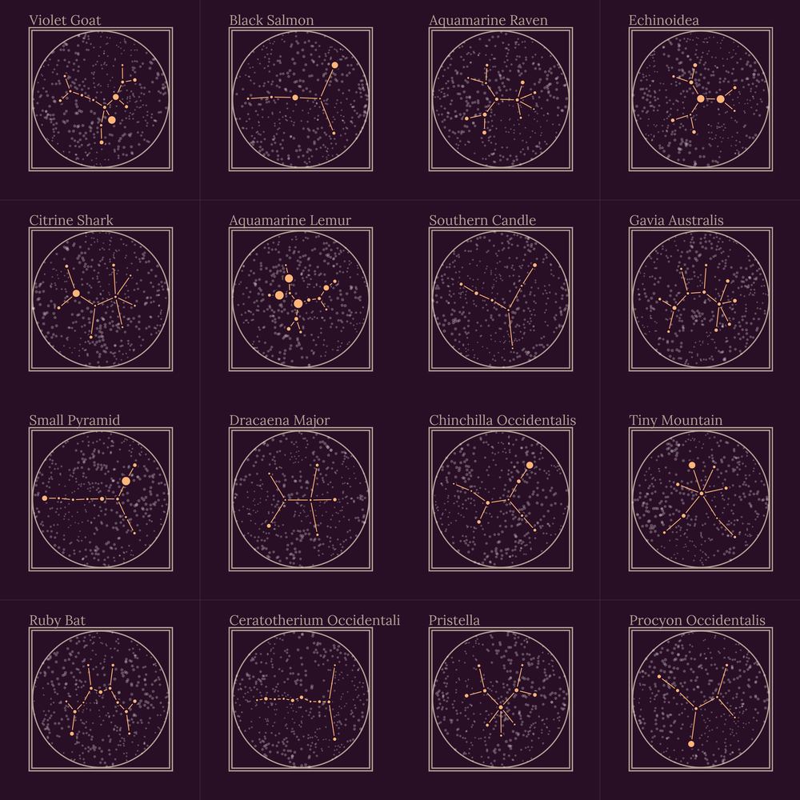

# Render galaxies, Blackholes and Star constellations in R

This was a project of mine ~2 years ok when I had an ambition to get into generative art. 
I abandoned that idea after this project because it just took too much time (and I lost motivation again...)
I now decided to release the code behind the project for everyone to play around with. You can do whatever you want with it.
Problem is that I neither documented the code nor my resources. So it may take some time and effort to understand what is going on here. 

# Example Galaxies

# Example Blackholes

# Example Constellations

